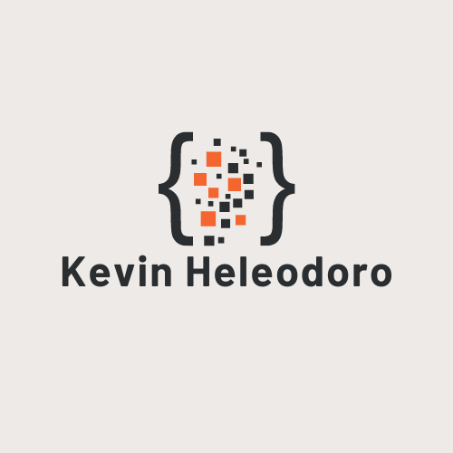

<a name="readme-top"></a>
[![LinkedIn][linkedin-shield]][linkedin-url]


<!-- PROJECT LOGO -->
<br />
<div align="center">
  <a href="https://github.khoury.northeastern.edu/NEU-CS5610-SU23/KevinHeleodoro-backend">
    
  </a>

<h3 align="center">MERN Project Frontend</h3>

  <p align="center">
    This project serves as the front end for the MERN Project. It will communicate with the backend and serve data to the client. There will be multiple stages of the implementation of the backend which will be documented in chronological order.
    <br />
    <a href="https://github.khoury.northeastern.edu/NEU-CS5610-SU23/KevinHeleodoro-frontend"><strong>Explore the docs »</strong></a>
    <br />
    <br />
    <!-- <a href="https://github.com/github_username/repo_name">View Demo</a>
    · -->
    <a href="https://github.khoury.northeastern.edu/NEU-CS5610-SU23/KevinHeleodoro-frontend/issues">Report Bug</a>
    ·
    <a href="https://github.khoury.northeastern.edu/NEU-CS5610-SU23/KevinHeleodoro-frontend/issues">Request Feature</a>
  </p>
</div>


<!-- TABLE OF CONTENTS -->
<details>
  <summary>Table of Contents</summary>
  <ol>
    <li>
      <a href="#about-the-project">About The Project</a>
      <ul>
        <li><a href="#built-with">Built With</a></li>
      </ul>
    </li>
    <li>
      <a href="#getting-started">Getting Started</a>
      <ul>
        <li><a href="#prerequisites">Prerequisites</a></li>
        <li><a href="#installation">Installation</a></li>
      </ul>
    </li>
    <li><a href="#roadmap">Roadmap</a></li>
    <li><a href="#contact">Contact</a></li>
    <li><a href="#acknowledgments">Acknowledgments</a></li>
  </ol>
</details>


<!-- ABOUT THE PROJECT -->
## About The Project
<!-- <p align="right">(<a href="#readme-top">back to top</a>)</p> -->


### Built With

* [![Node][Node.js]][Node-url]


<p align="right">(<a href="#readme-top">back to top</a>)</p>


<!-- GETTING STARTED -->
## Getting Started

To get a local copy up and running follow these simple example steps.

### Prerequisites

Ensure you have the latest version of npm installed.
  ```sh
  npm install npm@latest -g
  ```
Ensure you have version 18.15.0 of node installed through NVM.
  ```sh
  nvm install 18.15.0
  ```
Ensure you have the latest version of yarn installed.
  ```sh
  npm install -g yarn
  ```

### Installation

1. Clone the repo
   ```sh
   git clone https://github.khoury.northeastern.edu/NEU-CS5610-SU23/KevinHeleodoro-frontend.git
   ```
2. Install NPM packages
   ```sh
   yarn install
   ```

<p align="right">(<a href="#readme-top">back to top</a>)</p>


<!-- USAGE EXAMPLES
## Usage

Use this space to show useful examples of how a project can be used. Additional screenshots, code examples and demos work well in this space. You may also link to more resources.

_For more examples, please refer to the [Documentation](https://example.com)_

<p align="right">(<a href="#readme-top">back to top</a>)</p> -->


<!-- ROADMAP -->
## Roadmap

### Part 1
<!-- - [x] Set up backend directory
- [x] Install dependencies
- [x] Create base api and dao files
- [x] Restore dump file for movies database

![Directory Structure][backend-structure-screenshot]

![MongoDB Compass][mongo-restore-compass-screenshot] -->

See the [open issues](https://github.khoury.northeastern.edu/NEU-CS5610-SU23/KevinHeleodoro-frontend/issues) for a full list of proposed features (and known issues).

<p align="right">(<a href="#readme-top">back to top</a>)</p>


<!-- CONTACT -->
## Contact

Your Name - [@Golden_Sun_Kev](https://twitter.com/Golden_Sun_Kev) - heleodoro.k@northeastern.edu

Project Link: [https://github.khoury.northeastern.edu/NEU-CS5610-SU23/KevinHeleodoro-frontend](https://github.khoury.northeastern.edu/NEU-CS5610-SU23/KevinHeleodoro-frontend)

<p align="right">(<a href="#readme-top">back to top</a>)</p>


<!-- ACKNOWLEDGMENTS -->
## Acknowledgments

* [README badges](https://dev.to/envoy_/150-badges-for-github-pnk)
<!-- * []() -->
<!-- * []() -->

<p align="right">(<a href="#readme-top">back to top</a>)</p>


<!-- MARKDOWN LINKS & IMAGES -->
[linkedin-shield]: https://img.shields.io/badge/-LinkedIn-black.svg?style=for-the-badge&logo=linkedin&colorB=555
[linkedin-url]: https://linkedin.com/in/kevin-heleodoro


[Node.js]: https://img.shields.io/badge/Node.js-43853D?style=for-the-badge&logo=node.js&logoColor=white
[Node-url]: https://nodejs.org/en
